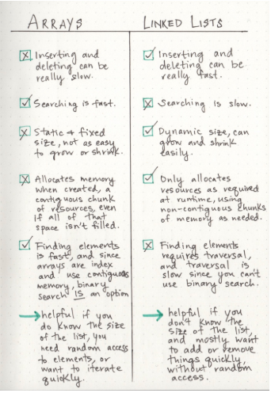
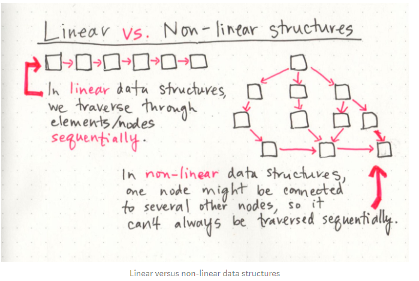
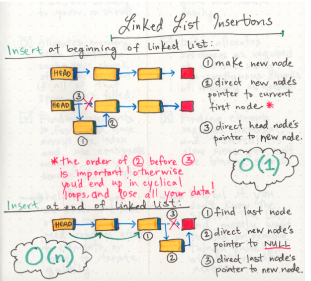
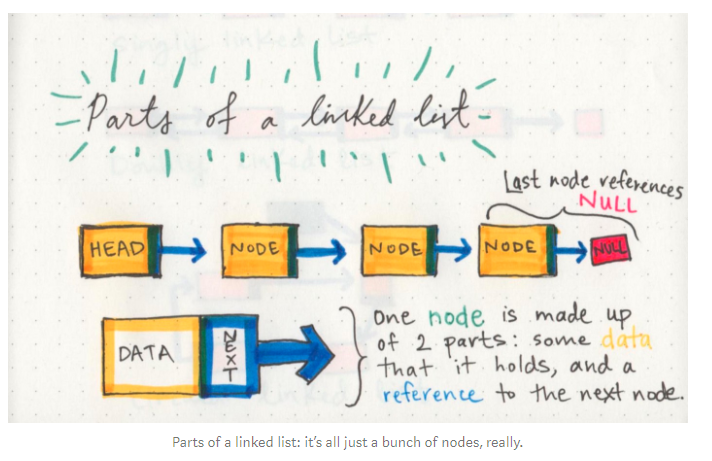
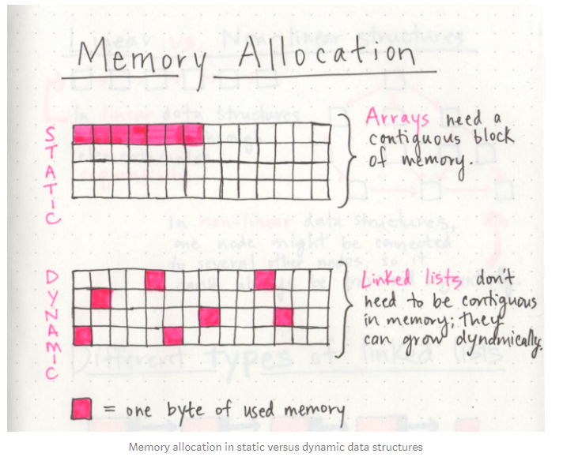

# Linked Lists 
  its one of the Linear data structures wich contain a sequence of nodes that are connected of each other  
  each node has a node next of it point to it 

  ## types of linked list :
  1. Singly Linked List  
      this one can only point to the next node  
  2. Doubly Linked List  
      this one can point to the next and the previous nodes 
  3. Circuler linked list  
      this dosen't end with null it has a node as a tail

  ## Terms 
  **Terms**  |  **Def**
----------- | ------------- 
Node        |   individual item that live in a linked list. Each node contains the data for each link.
Next        | property contains the reference to the next node
Head        | is the first node in the linked list
Current     | the node that we are currently looking at it

## each node has two properties :  
1. next : link to the next node  
2. value : the value of the current node  
- if it was a double link list it will have one more property :  
3. previous : link to the previous node  

### to add a node at the first position in a single linked list  
  1. set the current = head  
  2. set the .next to the new node = head  (after creation) 
  3. set the head = new node  
  4. finally set the current = head  
  - the big O here is : O(1)  

#### some usfull images 
   
   
   
   
   

