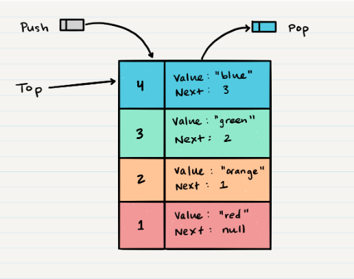
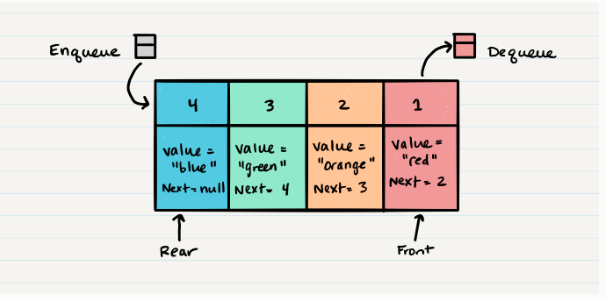

# Stacks and Queues

 ## Stack 
   - A stack is an array or list structure of function calls and parameters  
   - any element you insert to the stack it will be at the top of it  
   - and if you want to get element also you will the first element from the top  
  
  #### Common terminology for a stack 
   1. push --> add to stack  
   2. pop --> get from stack 
   3. Top --> top of stack 
   4. peek --> view the value of the top  
   5. IsEmpty --> returns true when queue is empty otherwise returns false.  

    


  #### (FILO) or (LIFO)
    **F**irst **I**n **L**ast **O**ut  
    **L**ast **I**n **F**irst **O**ut   

  - push ALOGORITHM  
  
   ```  
   node = new Node(value)
   node.next <-- Top
   top <-- Node

   ``` 
- pop ALOGORITHM  

   ```  
   Node temp <-- top
   top <-- top.next
   temp.next <-- null
   return temp.value

   ``` 


   ## Queue 
   - a queue is a data structure in which elements are removed in the same order they were entered  
  
  #### Common terminology for a stack 
   1. Enqueue  --> Nodes or items that are added to the queue.    
   2. Dequeue --> Nodes or items that are removed from the queue. If called when the queue is empty an exception will be raised.  
   3. Front --> This is the front/first Node of the queue.  
   4. peek --> view the value of the front  
   5. Rear --> This is the rear/last Node of the queue.  
   6. IsEmpty --> returns true when queue is empty otherwise returns false.  

    

  #### (FIFO)
    **F**irst **I**n **F**irst **O**ut  


- Enqueue  ALOGORITHM  
  
   ```  
   node = new Node(value)
   rear.next <-- node
   rear <-- nod

   ``` 
- Dequeue ALOGORITHM  

   ```  
  Node temp <-- front
  front <-- front.next
  temp.next <-- null
  return temp.value

   ``` 

  


  


 