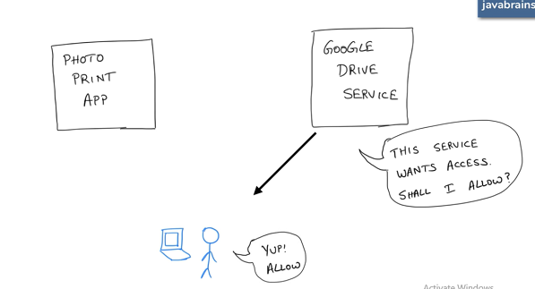
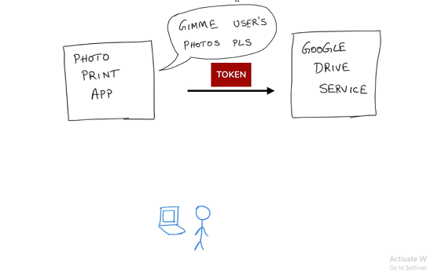

# OAuth  
  - Authorization between services 
  - is “an open standard for access delegation”  
  -  OAuth serves as a way to give users the ability to grant application access to services, without giving the application their password.  

## How does OAuth work?  
  
1. the asks the user for specific permissions  
2. the user agrees  
3. Remote service contacts the application with a one-time-use  
4. the application calls back to a special address on the remote service to exchange that Code for a Token  
5. Once the token has been granted, the application will then be able to contact the remote service, using that Token to access information on behalf of the user  

#### example :
 1.     
   
 2.   
   
 3.    

 #### Terms :
  - **The Third-Party Application: "Client"** 
    The client is the application that is attempting to get access to the user's account. It needs to get permission from the user before it can do so.  
  - **The API: "Resource Server"**  
    The resource server is the API server used to access the user's information.  
  - **The User: "Resource Owner"**  
    The resource owner is the person who is giving access to some portion of their account.  
  - **The Authorization Server**  
    This is the server that presents the interface where the user approves or denies the request. In smaller implementations, this may be the same server as the API server, but larger scale deployments will often build this as a separate component.
     

