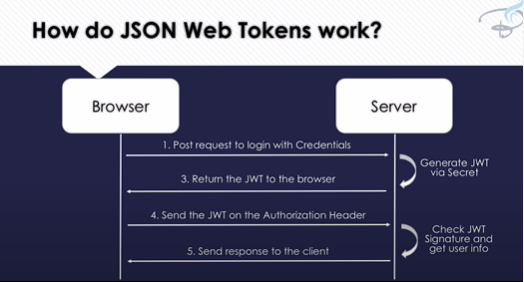

# Bearer Authorization  

  - Bearer Tokens are encoded JSON objects that “bear” or “contain” enough information for the server to assert that any client request that presents a valid token must have originated from a client that has previously authenticated themselves using either Basic or OAuth.  
  - Upon receiving a Bearer Token from a client, the server can decode it, inspect the JSON object inside, look up the appropriate account, and re-authenticate the user in a single lookup.  

## JSON Web Tokens(JWT)  
  -  is an open standard that defines a compact and self-contained way for securely transmitting information between parties (servers, clients, etc) as a JSON object.  
  - This information can be verified and trusted because it is digitally signed  
  - JWTs can be signed using a secret (with the HMAC algorithm) or a public/private key pair using RSA or ECDSA.  
  -  JWTs can be encrypted to also provide secrecy between parties  

## When should you use JSON Web Tokens?  
 1. Authorization  
   -  the most common scenario for using JWT
   - Once the user is logged in, each subsequent request will include the JWT  
   - allowing the user to access routes, services, and resources that are permitted with that token  
 2. Information Exchange  
   - JSON Web Tokens are a good way of securely transmitting information between parties  
      + Because JWTs can be signed   

 
## How do json web token work ? 
  

   

