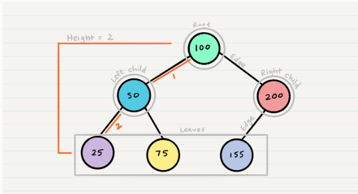

# Trees  

## Common Terminology of Tree
 - Node --> is the individual item/data that makes up the data structure  
 - Root -->  is the top Node in the tree
 - Left Child --> The node that is positioned to the left of a root or node
 - Right Child --> The node that is positioned to the right of a root or node
 - Edge --> The edge in a tree is the link between a parent and child node
 - Leaf --> is a node that does not contain any children
 - Height --> The height of a tree is determined by the number of edges from the root to the bottommost node

### sample : 
   

## There are two categories of traversals when it comes to trees:  
1. Depth First (this way uses stack)  
   Depth first traversal is where we prioritize going through the depth (height) of the tree first  
   it has three methods :  
     - Pre-order: `root >> left >> right`  
     - In-order: `left >> root >> right`  
     - Post-order: `left >> right >> root`  

2. Breadth First(this way uses queue)  
  Breadth first traversal iterates through the tree by going through each level of the tree node-by-node.  

## Binary Tree  
 Trees can have any number of children per node, but Binary Trees restrict the number of children to two (hence our left and right children).  

## Binary Search Tree  
 A Binary Search Tree (BST) is a type of tree that does have some structure attached to it. In a BST, nodes are organized in a manner where all values that are smaller than the root are placed to the left, and all values that are larger than the root are placed to the right.

  

