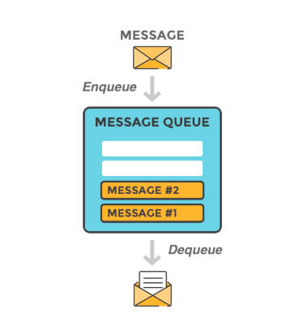

# Message Queues  
 we know that the queue is a line of things waiting to be handled, starting at the beginning of the line and processing it in sequential order  
 so the **message queue** is a queue of messages sent between applications.  

 - It includes a sequence of work objects that are waiting to be processed
 - it allows applications to communicate by sending messages to each other  
 - it provides temporary message storage when the destination program is busy or not connected.  

  

## What is a message?  
  is a package of information, categorized by :
   - **queue** --> Which general bucket does this message belong for example “Database Events”, “Filesystem Events”  
   - **event** --> What event has happened like “delete, add, update, connection lost, error”, etc.  
   - **payload** --> data associated with the event like  “record id, record information, error text”, etc.  

   
