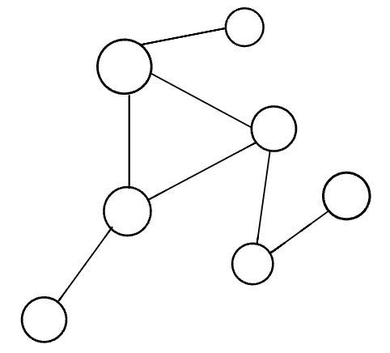
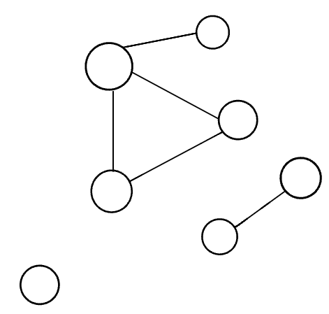

# Graphs  
 A graph is a non-linear data structure that can be looked at as a collection of nodes potentially connected by line segments named edges.  

## Terminologies  
    **Term**    |  **Def**  
    ----------- | -------------  
    Vertex      |  A vertex, also called a “node”, is a data object that can have zero or more adjacent vertices.  
    Edge        |  An edge is a connection between two nodes.  
    Neighbor    |  The neighbors of a node are its adjacent nodes, i.e., are connected via an edge.  
    Degree      |  The degree of a vertex is the number of edges connected to that vertex.  

## Undirected Graphs  
  An Undirected Graph is a graph where each edge is undirected or bi-directional.  
  This means that the undirected graph does not move in any direction.  

## Directed Graphs (Digraph)  
  A Directed Graph also called a Digraph is a graph where every edge is directed.  

## Complete Graphs  
  A complete graph is when all nodes are connected to all other nodes.  
   

## Connected  
  A connected graph is graph that has all of vertices/nodes have at least one edge  
   

## Disconnected  
  A disconnected graph is a graph where some vertices may not have edges.  
   

